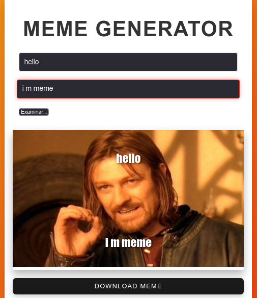

# Meme Generator

This is a meme generator built in React that allows users to upload an image, add text at the top and bottom, and download the resulting meme in image format.
## Characteristics

- Upload a custom image
- Add text to the top and bottom of the image.
- Download the generated meme as an image (`.png`).
- Default image in case none is loaded.


### App preview




## Technologies Used

- **React**: JavaScript library for building user interfaces.
- **html2canvas**: Library for capturing HTML content and converting it to an image.
- **CSS**: For custom styles used in the application.

## Prerequisites

To run this project locally, you need the following installed:

- [Node.js](https://nodejs.org/en/) (version 16 or higher)
- [npm](https://www.npmjs.com/)

## Installation

Follow these steps to install and run the project locally:

1. Clone this repository:

    ```bash
    git clone https://github.com/armandonum/Meme_Generator.git
    ```

2. Navigate to the project directory:

    ```bash
    cd Memes_Generator
    ```

3. Install the dependencies:

    ```bash
    npm install
    ```

4. Start the development server:

    ```bash
    npm run dev
    ```

5. Open your browser at `http://localhost:3000` to view the running application.

## Usage

1. Enter the text you want to appear at the top and bottom of the image using the input fields.
2. Upload an image from your device by clicking the file selection button. If no image is uploaded, a default image will be used.
3. Click the **Download Meme** button to download the generated image as a `.png` file.

## Project Structure

```bash
src/
│
├── components/
│   └── MemeGenerator.tsx  
│
├── styles/
│   └── MemeGenerator.css 
│
└── App.tsx 
```

### Code Explanation

- **`MemeGenerator.tsx`**: Contains the main component for the meme generator. It uses `useState` to manage the top text, bottom text, and the URL of the uploaded image. The `html2canvas` function captures the generated meme and converts it into a downloadable image.
- **`MemeGenerator.css`**: CSS file that defines the styles for the meme generator, including the positions of the top and bottom text, the download button, and the layout of the uploaded image.

## Docker

To run the application in a Docker container, follow these steps:

1. Build the Docker image:

    ```bash
    docker build -t meme-generator .
    ```

2. Run the container:

    ```bash
    docker run -p 3000:3000 meme-generator
    ```
3. pull to images 
    ```bash
    docker pull armando4049/meme-generator
    ```
4. run the images 
    ```bash
    sudo docker run -d -p 3000:80 armando4049/meme-generator
    ```


## Contributing

If you would like to contribute to this project:

1. Fork the repository.
2. Create a new branch (`git checkout -b feature/new-feature`).
3. Make your changes and commit them (`git commit -am 'Added new feature'`).
4. Push your changes to the forked repository (`git push origin feature/new-feature`).
5. Open a Pull Request.

